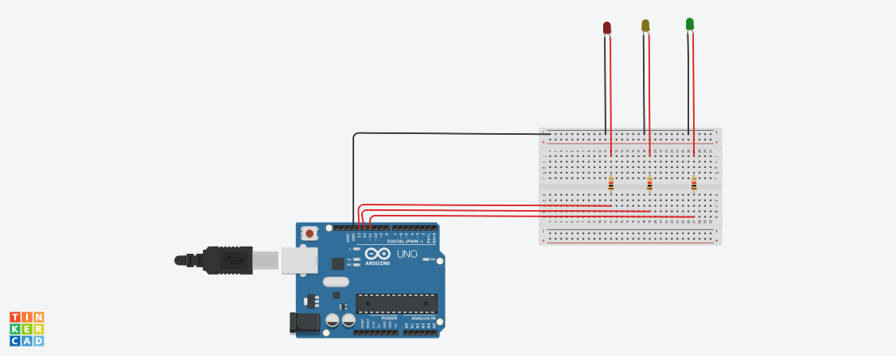

# Projeto_Semáforo

# Parte 1: Montagem Física do Semáforo
O desenvolvimento deste projeto se consistiu na aplicação de simples componentes eletrônicos que combinados foi possível simular as luzes de um semáforo (Vermelho, Amarelo e Verde ), conforme as seguintes pré-definições:
- 6 segundos para a cor vermelha
- 2 segundos para a cor amarela
- 2 segundos para a cor verde
- +2 segundos para a cor verde (simulando um tempo adicional para pedestres terminarem a travessia)
- 2 segundos para cor amarela novamente
- Esse ciclo deve ser repetido continuamente em um loop.


Link para o vídeo demonstração do semáforo: https://www.youtube.com/watch?v=Twb2jBsBsNE
## 1.1 Processo de montagem
O projeto seguiu a seguinte diagrama esquemático: 

Link para o diagrama esquemático:
https://www.tinkercad.com/things/4AnVdyHInrI/editel?returnTo=%2Fdashboard%2Fdesigns%2Fcircuits&sharecode=xE9b-Nv8BAjC14rJ4omI4LbNLeO0ZW9xsoOpgPuNAEk


### 1.1.1 Componentes utilizados:
| **Componente**          | **Descrição**                               | **Valor/Modelo**                          |
|-------------------------|---------------------------------------------|-------------------------------------------|
| **Arduino UNO**         | Microcontrolador para controle do circuito | Arduino UNO                               |
| **Protoboard**         | Placa de ensaio para montagem de circuitos | Protoboard padrão                         |
| **LED Vermelho**        | Diodo emissor de luz vermelho               | 3 mm ou 5 mm, Tensão de 3,3V             |
| **LED Amarelo**         | Diodo emissor de luz amarelo                | 3 mm ou 5 mm, Tensão de 3,3V             |
| **LED Verde**           | Diodo emissor de luz verde                  | 3 mm ou 5 mm, Tensão de 3,3V             |
| **Resistor**            | Limita a corrente passando pelo LED        | 220 ohms, 0,25W (ou 0,5W)                |
| **Fios de Conexão**     | Fios para conectar os componentes           | Fios jumper de vários tamanhos            |
| **Cabo USB**            | Para conectar o Arduino ao computador       | Cabo USB tipo A para tipo B               |


### 1.1.2 Processo de montagem:

1. **Configuração da Protoboard:**

- Os LEDs foram inseridos na protoboard, com o terminal longo (positivo) conectado ao GND e o terminal menor (negativo) conectado ao resistor, o qual está conectado ao respectivo pino de cada LED.

2. **Conexões dos LEDs:**

- Cada LED foi conectado a um resistor de 220 ohms, que, por sua vez, foi ligado a uma linha de terra (GND) na protoboard.
- Os terminais negativos (curtos) dos LEDs foram conectados aos pinos digitais do Arduino (pino 13 para o LED vermelho, pino 12 para o LED amarelo, pino 11 para o LED verde).

3. **Conexões ao Arduino:**

- A linha de terra da protoboard foi conectada ao pino GND do Arduino.

4. **Adição do código para o funcionamento do simulador do semáforo**

# Parte 2: Programação e Lógica do Semáforo
Para a programação do semáforo foi utilizado o seguinte código:
```c++

const byte VERMELHO = 13; //LED Vermelho conectado no pino 13 
const byte AMARELO = 12;  //LED Amarelo conectado no pino 12 
const byte VERDE  = 11;    //LED Azul conectado no pino 11 


void setup() {
  
  pinMode(VERMELHO, OUTPUT); //Pino do LED vermelho definido como saída
  pinMode(AMARELO, OUTPUT);  //Pino do LED amarelo definido como saída
  pinMode(VERMELHO, OUTPUT); //Pino do LED azul definido como saída
}

void loop() {

  digitalWrite(VERMELHO, HIGH); // Liga o LED vermelho no Arduino  

  delay(6000);                  // Deixa o LED ligado por 6000 milissegundos (6 segundos).

  digitalWrite(VERMELHO, LOW);  //Desliga o LED vermelho no Arduino  

  digitalWrite(AMARELO, HIGH);  // Liga o LED amarelo no Arduino 

  delay(2000);                  // Deixa o LED amarelo ligado por 2000 milissegundos (2 segundos).

  digitalWrite(AMARELO, LOW);   //Desliga o LED amarelo no Arduino  

  digitalWrite(VERDE, HIGH);    // Liga o LED verde no Arduino 

  delay(4000);                  // Deixa o LED verde ligado por 4000 milissegundos (4 segundos).

  digitalWrite(VERDE, LOW);     //Desliga o LED verde no Arduino

  digitalWrite(AMARELO, HIGH);  // Liga o LED amarelo no Arduino  

  delay(2000);                  // Deixa o LED amarelo ligado por 2000 milissegundos (2 segundos).

  digitalWrite(AMARELO, LOW);   // Desliga o LED amarelo no Arduino

  }


```


# Template Avaliação Pares


### Avaliador: Sophia Senne

| Critério                                                                                                 | Contempla (Pontos) | Contempla Parcialmente (Pontos) | Não Contempla (Pontos) | Observações do Avaliador |
|---------------------------------------------------------------------------------------------------------|--------------------|----------------------------------|--------------------------|---------------------------|
| Montagem física com cores corretas, boa disposição dos fios e uso adequado de resistores                |  3              |                             |                         |                           |
| Temporização adequada conforme tempos medidos com auxílio de algum instrumento externo                  |  3              |                           |                         |                           |
| Código implementa corretamente as fases do semáforo e estrutura do código (variáveis representativas e comentários) | 3              |                           |                         |                           |
| Extra: Implementou um componente de liga/desliga no semáforo e/ou usou ponteiros no código |  1              |                           |                         |                           |
|  |                                                             |  | |**Pontuação Total: 10**| 


### Avaliador: Gustavo Colombini
Critério                                                                                                 | Contempla (Pontos) | Contempla Parcialmente (Pontos) | Não Contempla (Pontos) | Observações do Avaliador |
|---------------------------------------------------------------------------------------------------------|--------------------|----------------------------------|--------------------------|---------------------------|
| Montagem física com cores corretas, boa disposição dos fios e uso adequado de resistores                |  3              |                             |                         |                           |
| Temporização adequada conforme tempos medidos com auxílio de algum instrumento externo                  |  3              |                           |                         |                           |
| Código implementa corretamente as fases do semáforo e estrutura do código (variáveis representativas e comentários) | 3              |                           |                         |                           |
| Extra: Implementou um componente de liga/desliga no semáforo e/ou usou ponteiros no código |  1              |                           |                         |                           |
|  |                                                             |  | |**Pontuação Total: 10**|